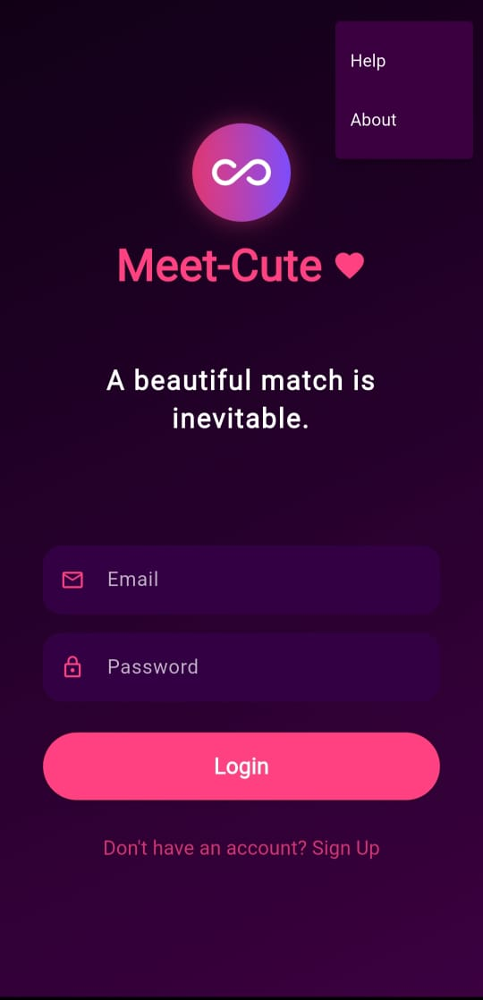
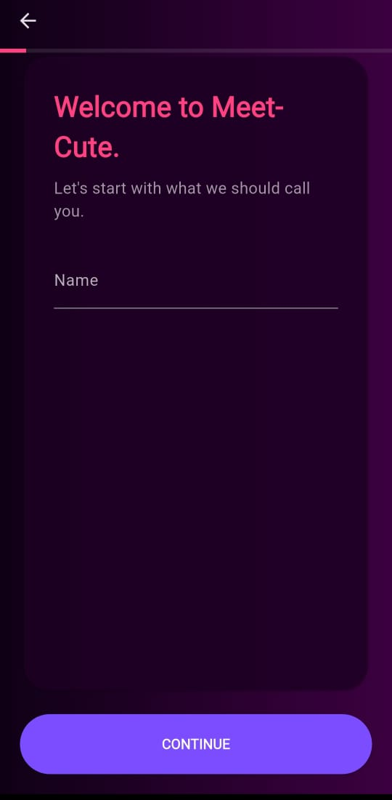
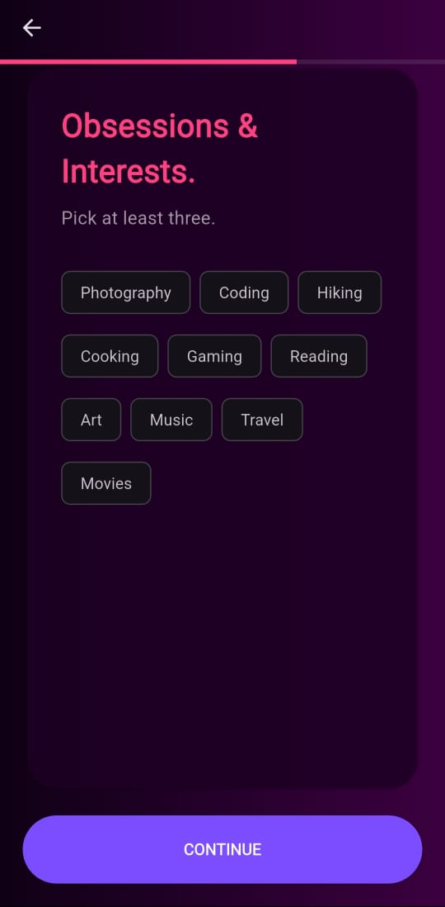
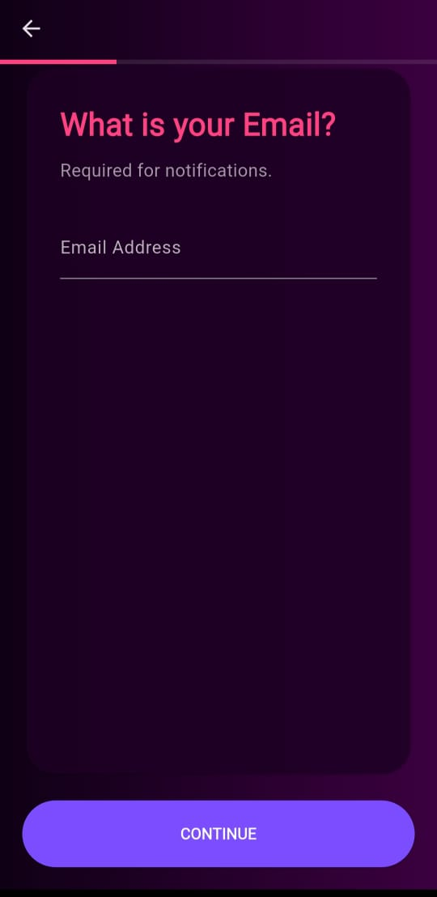
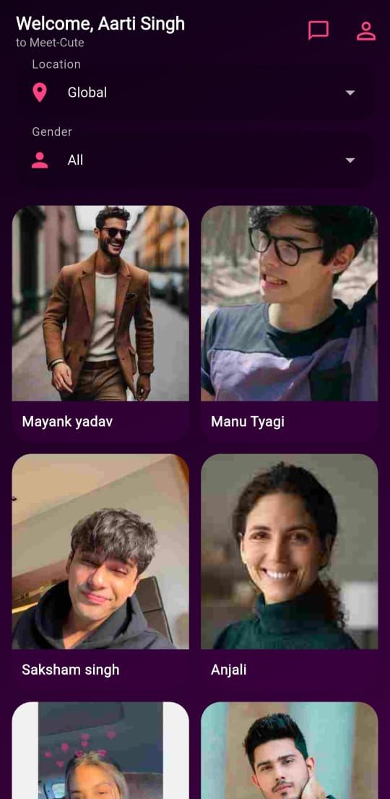
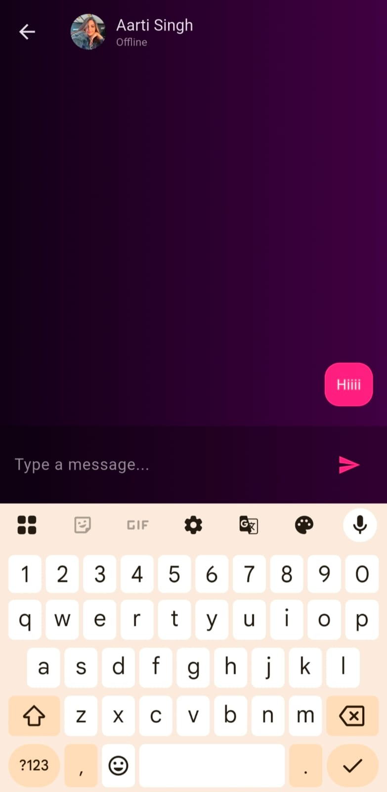

#  Secure Matchmaking App

A secure matchmaking application developed using **Flutter** and **Firebase**, designed to provide a safe and user-friendly platform for connecting people. The application focuses on secure authentication, verified user accounts, real-time communication, and data privacy.

##  Features

*  Secure Email & Password Authentication using Firebase Authentication
*  Email Verification before account access
*  Multi-step User Registration (Name, Date of Birth, Gender, Profile Details, etc.)
*  AES Encryption for protecting sensitive user data
*  Verified User Accounts
*  Real-time Chat Functionality
*  Online/Offline User Status
*  User Profile Viewing
*  Responsive Flutter UI with multiple interactive screens
*  Firebase Firestore for secure cloud data storage
*  Firebase Storage for profile images and media

##  Tech Stack

* Flutter
* Dart
* Firebase Authentication
* Cloud Firestore
* Firebase Storage
* AES Encryption
* Material Design

##  Project Overview

This project demonstrates secure mobile application development using Flutter and Firebase. It implements authentication, email verification, encrypted user data handling, profile management, and real-time chat while maintaining a clean and responsive user interface.

##  Future Enhancements

* Voice & Video Calling
* Push Notifications
* Advanced User Search & Filters
* Friend Request & Block Features
* Admin Dashboard
* Enhanced Security Features

## 📱 Application Screenshots

  
  
  

  
  
  

  
  
  

## Developer

**Kavya Tyagi**

Developed as a secure Flutter-Firebase application to showcase modern mobile application development, authentication mechanisms, and secure data management practices.

